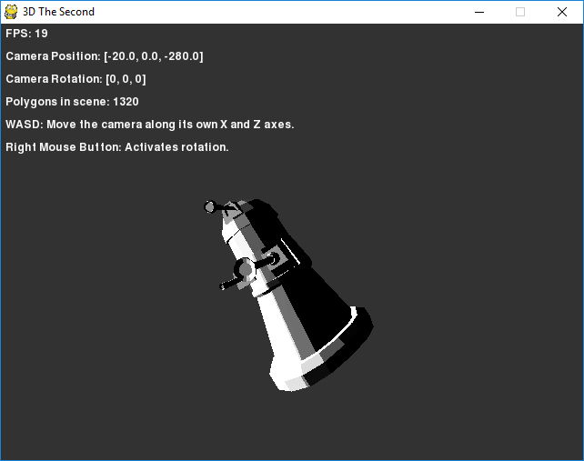
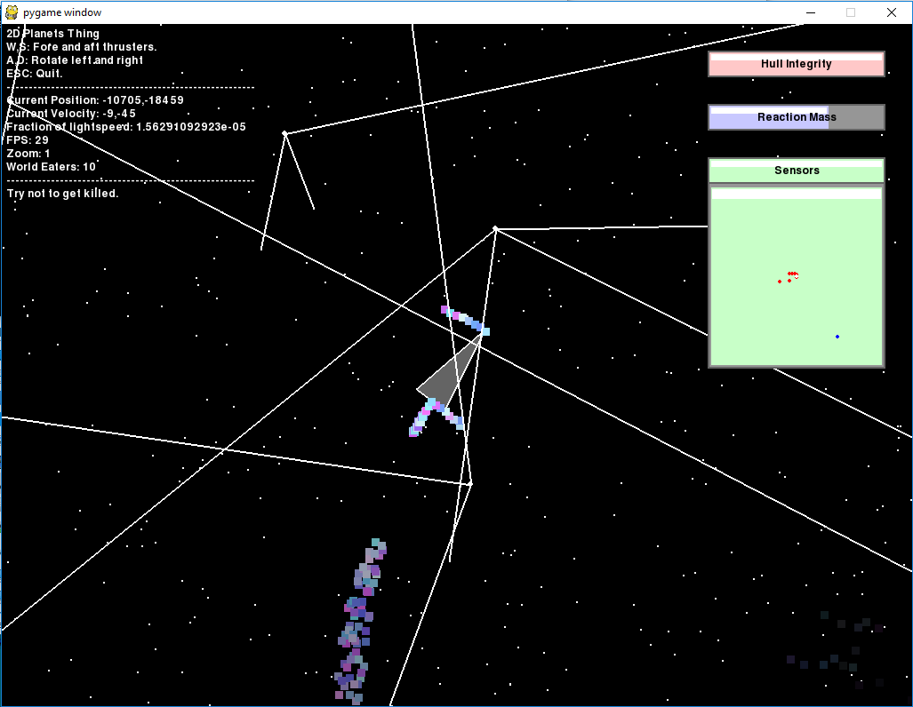
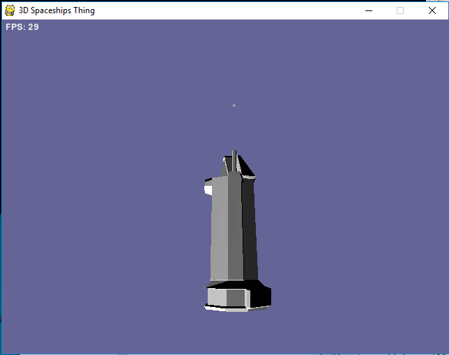

Old Stuff
=========

A place to store things I made a long time ago, which I have recently salvaged from an old
external hard drive and uploaded to github for safe keeping. Each salvaged project has
a directory in the repository, and has a section in this readme file. Any editing in the
course of migration to github has been limited to making the things run in python 2.7. I 
have ordered them from most to least interesting (as I see it anyway.)

I'll probably add more stuff over time, I do have at least a couple more things in the 
archive that are worth digging out. Many things have just been lost - always back up your
stuff, kids.

Note that none of the code is particularly good. I wrote it a long time ago. The projects
herein really only have value as curiosities, and probably only to me. You have been warned.

Contents
--------

* Python Software Renderer
* 2D Planets
* Python Software Renderer Spaceships

Python Software Renderer
------------------------

This is a software 3d renderer written in Python. To my recollection, it is based primarily
on maths gotten out of an old geocities web page which is now defunct - this was some time
in 2007/8. I have a word document I compiled at the time out of all of the contents, which
I might upload somewhere some day.

Anyway, it can do coloured (flat) lighting and texture mapping. There's some code in there
for reading in a heightfield and generating triangles. Speaking of which, the "models" are
in python files. I believe I created these by exporting .obj files from wings3d and then
editing them into python syntax with notepad. Yes.

Polygons are transformed into screen space and then either rendered via pygame.draw if texture
mapping is off, or rendered "by hand" if it is. The scan conversion algorithm was taken from
the aforementioned geocities page, but I'm 99% sure the *code* is my own. Memory is hazier
when it comes to the inner loop for texture mapping - something tells me it's at least based
on an old tutorial from the 90s in assembly language. The code is full of strange "optimisations" 
and weird conventions. I think much of the stuff I was reading about simple 3d rendering in early 
games was written with assembly lanuage and old hardware in mind, and it rubbed off in the wrong 
way...

You configure it by editing the code at the start of the main file, as one does. There are
a few different "scenes" it can display - again, you have to edit the code.

### Dependencies

* Python 2.7 [It might work with older versions; I wrote it with 2.5 after all.]
* Pygame

It does try to load psyco, but can manage without it. Psyco is now defunct, so I wouldn't
bother trying it. I *think* it might also use numpy but I don't remember.

2D Planets
----------

An unfinished asteroids-like with basic Newtonian physics (including gravity!) The starfield
background doppler shifts as you go faster which is a nice touch I think :) Weird spindly
things chase you around; I think they eat the planets and spawn more of themselves.

### Dependencies

* Python 2.7 [It might work with older versions; I wrote it with 2.5 after all.]
* Pygame

As above, it does try to load psyco but works fine without it, and psyco is dead.

Python Software Renderer Spaceships
-----------------------------------

This appears to be a spaceship rendered with a slightly refined version of the python software
renderer. I think I wanted to make some sort of arcade space game but didn't get very far with
it. What we have is a space ship with some turrets shooting cubes repeatedly.

Because I didn't know what version control was back in the day, digging through all this stuff
there's often like 10 different forked versions of things and it's hard to figure out what the
"definitive" version of something is, if there even is one. So while I'm not sure this really
deserves its own spot here, it does run and is a bit different from the original so I've
included it anyway.

### Dependencies

Same as the original version.
